### **实验四**：shell脚本编程实验

#### 实验环境

- Ubuntu 20.04
- bash
- imagemagick

#### 实验过程与数据统计结果：

任务一：用bash编写一个图片批处理脚本，实现以下功能
* [image.sh](codes/image.sh)
- [x] 支持命令行参数方式使用不同功能
- [x] 支持对指定目录下所有支持格式的图片文件进行批处理
- [x] 支持以下常见图片批处理功能的单独使用或组合使用
- [x] 支持对jpeg格式图片进行图片质量压缩
- [x] 支持对jpeg/png/svg格式图片在保持原始宽高比的前提下压缩分辨率
- [x] 支持对图片批量添加自定义文本水印
- [x] 支持批量重命名（统一添加文件名前缀或后缀，不影响原始文件扩展名）
- [x] 支持将png/svg图片统一转换为jpg格式图片

下载imagemagick：

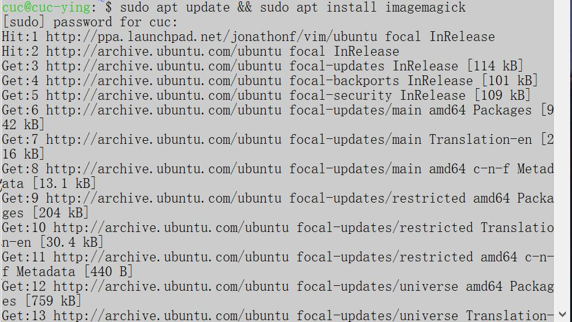

下载imagemagick成功：

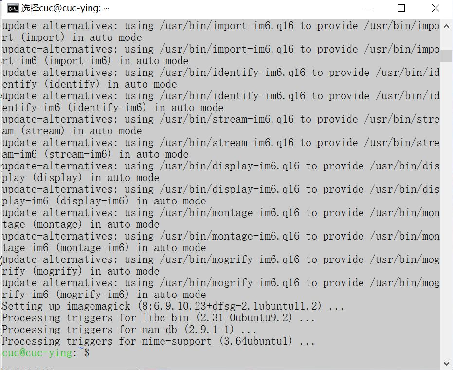

进行编码：

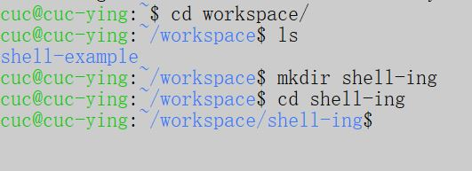

将需要进行处理的图片传入虚拟机：

```shell
scp -r C:\Users\DELL\Desktop\2021-linux-public-real-pcl\chap0x04\chap0x04\img_before cuc@192.168.56.103:/home/cuc/workspace
```

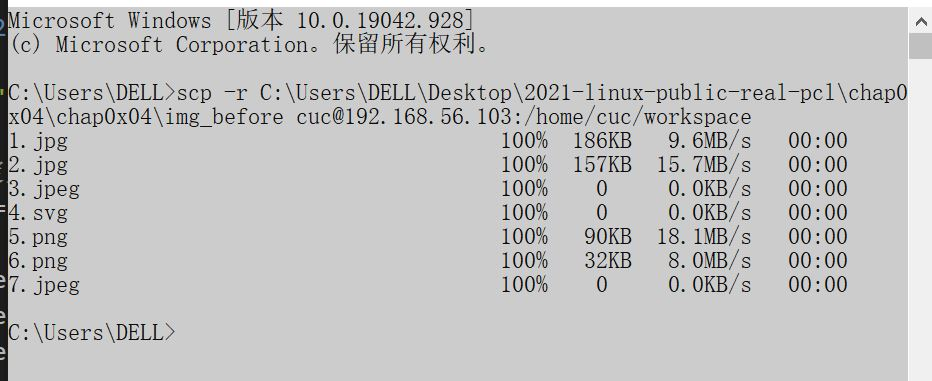

``` shell
#-help脚本内置帮助信息:

-d  <path>	: 输入操作图片路径
-q <percentage> ：压缩图片质量
-r <width> ：压缩图片分辨率
-w <text> ：在所有图片中嵌制水印
-p <pre_text> ：添加前置重命名所有文件
-s <suf_text> ：通过添加后缀重命名所有文件
-c ：将PNG/SVG图像转换为JPEG图像
-h or --help ：打印帮助消息并退出
```
- 测试：
  
``` shell
# help帮助文档
bash image.sh -h
```
help-1:
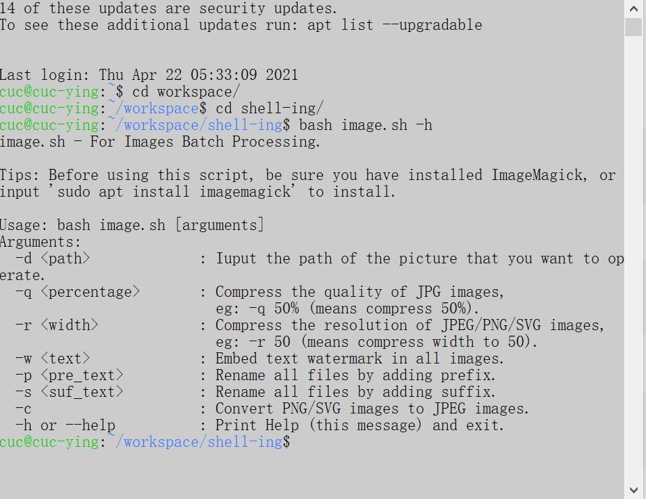

``` shell
# 对jpeg格式图片进行图片质量压缩
 bash image.sh -d img_before/ -q 50%
```
压缩：


``` shell
# 对jpeg/png/svg格式图片在保持原始宽高比的前提下压缩分辨率
 bash image.sh -d img_before/ -r 90
```
压缩分辨率：


``` shell
# 对图片批量添加自定义文本水印
 bash image.sh -d img_before/ -w "bl"
```
加水印：


``` shell
# 批量重命名（统一添加文件名前缀或后缀，不影响原始文件扩展名）
 bash image.sh -d img_before/ -p "Pre"
 bash image.sh -d img_before/ -s "Tail"
```
添加前后缀.jpg:
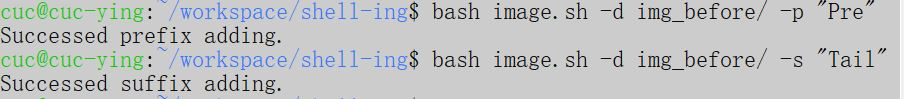

``` shell
# 将png/svg图片统一转换为jpg格式图片
 bash image.sh -d img_before/ -c 100
```
图片全部转换为jpg形式:


将处理后的图片全部导出：

```shell
scp -r cuc@192.168.56.103:/home/cuc/workspace/shell-ing/out_c C:\Users\DELL\Desktop\2021-linux-public-real-pcl\chap0x04\chap0x04\img_after
scp -r cuc@192.168.56.103:/home/cuc/workspace/shell-ing/out_p C:\Users\DELL\Desktop\2021-linux-public-real-pcl\chap0x04\chap0x04\img_after
scp -r cuc@192.168.56.103:/home/cuc/workspace/shell-ing/out_q C:\Users\DELL\Desktop\2021-linux-public-real-pcl\chap0x04\chap0x04\img_after
scp -r cuc@192.168.56.103:/home/cuc/workspace/shell-ing/out_r C:\Users\DELL\Desktop\2021-linux-public-real-pcl\chap0x04\chap0x04\img_after
scp -r cuc@192.168.56.103:/home/cuc/workspace/shell-ing/out_s C:\Users\DELL\Desktop\2021-linux-public-real-pcl\chap0x04\chap0x04\img_after
scp -r cuc@192.168.56.103:/home/cuc/workspace/shell-ing/out_w C:\Users\DELL\Desktop\2021-linux-public-real-pcl\chap0x04\chap0x04\img_after
```
out_c：
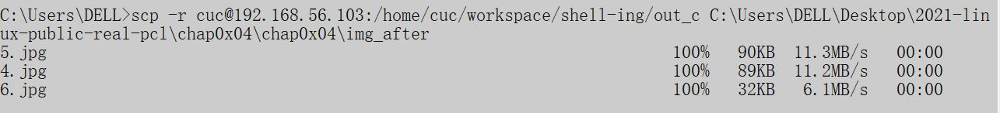

out_p:
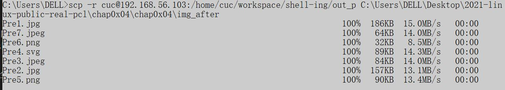

out_q:
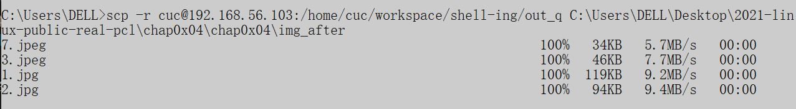

out_r:
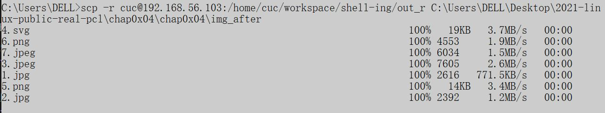

out_s
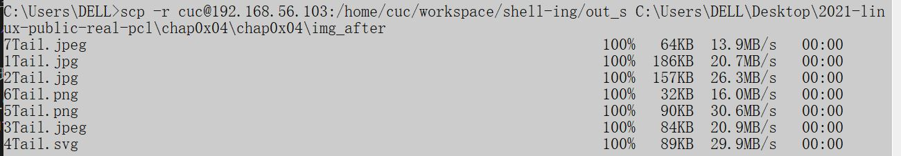

out_w:
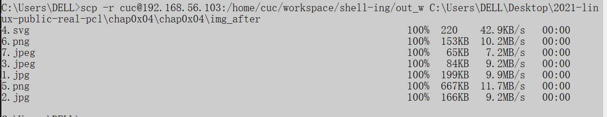

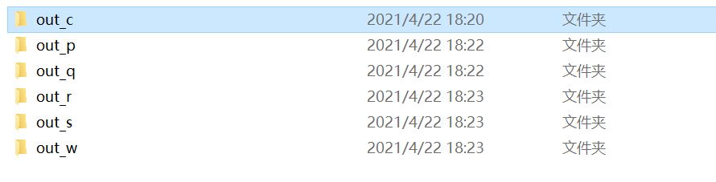

------


##### 任务二：用bash编写一个文本批处理脚本，对以下附件分别进行批量处理完成相应的数据统计任务

#####   2014世界杯运动员数据实验
* [2014世界杯运动员数据](worldcupplayerinfo.tsv)
* [player.sh](codes/player.sh)
- [x] 统计不同年龄区间范围（20岁以下、[20-30]、30岁以上）的球员**数量**、**百分比**
- [x] 统计不同场上位置的球员**数量**、**百分比**
- [x] 名字最长的球员是谁？名字最短的球员是谁？
- [x] 年龄最大的球员是谁？年龄最小的球员是谁？

- 测试与结果：

``` shell
# help帮助文档
 bash player.sh -h
```
help-2:
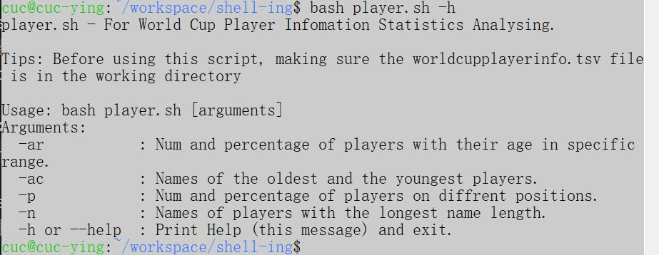


``` shell
#-help脚本内置帮助信息：

#世界杯球员信息统计分析
#在使用此脚本之前，请确保世界杯玩家信息.tsv文件在工作目录中
#用法：

- ar：特定年龄段球员的数量和百分比
- ac：年级最大和最小球员的名字
- p:统计不同场上位置的球员数量、百分比
- n:名字最长和最短球员的名字
- h or --help:打印帮助信息并退出

```

```shell
#统计不同年龄区间范围（20岁以下、[20-30]、30岁以上）的球员数量、百分比
 bash player.sh -ar
```
 
|   年龄范围 | 球员数量  | 百分比    |
|    ----   |   ----    |  ----    |
|(0, 20)    |    9      |  1.223%  |
|[20, 30]   |    600    | 81.522%  |
|(30, +∞)   |    127    | 17.255%  |

![统计不同年龄区间范围（20岁以下、[20-30]、30岁以上）的球员数量、百分比](img/统计不同年龄区间范围（20岁以下、[20-30]、30岁以上）的球员数量、百分比.jpg)

``` shell
#统计不同场上位置的球员数量、百分比
 bash player.sh -p
```
|    场地名  | 球员数量  | 百分比    |
|    ----   |   ----    |  ----    |
|Midfielder |    268    | 36.413%  |
| Goalie    |    96     | 13.043%  |
|Defender   |    236    |  32.065% |
|Défenseur  |     1     |  0.136%  |
|Forward    |    135    |  18.342% |

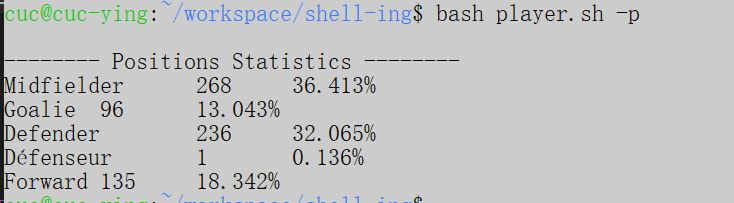

```shell
#统计名字最长和最短的球员
 bash player.sh -n
```
|名字最长球员姓名          |长度   |
|---                      |---   |
|Francisco Javier Rodriguez Lazaros Christodoulopoulos Liassine Cadamuro-Bentaeba|26|

|名字最短球员姓名|长度|
|---            |--|
|Jô             |2 |

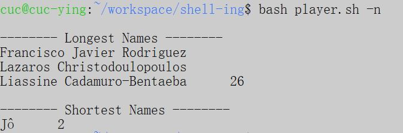

```shell
#统计年龄最大和最小的球员
 bash player.sh -ac
```
|年龄最大球员姓名|年龄|
|---           |--- |
|Faryd         | 42 |
|Mondragon     | 42 |

|年龄最小球员姓名|年龄|
|---            |---|
|Fabrice        |18 |
|Olinga         |18 |
|Luke           |18 |
|Shaw           |18 |

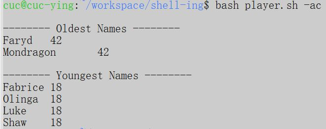

---

#####   Web服务器访问日志
* [weblog.sh](codes/weblog.sh)
- [x] 统计访问来源主机TOP 100和分别对应出现的总次数
- [x] 统计访问来源主机TOP 100 IP和分别对应出现的总次数
- [x] 统计最频繁被访问的URL TOP 100
- [x] 统计不同响应状态码的出现次数和对应百分比
- [x] 分别统计不同4XX状态码对应的TOP 10 URL和对应出现的总次数
- [x] 给定URL输出TOP 100访问来源主机

- 测试与结果：
  
```shell
 # help帮助文档
 bash weblog.sh -h
```
help-3:
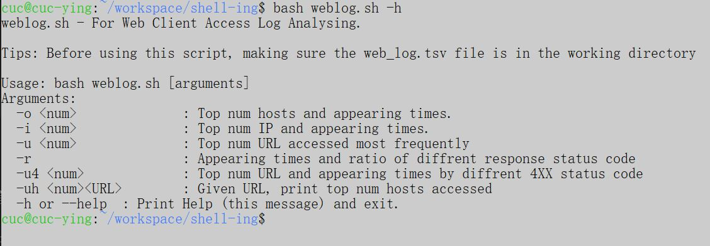

``` shell
#-help脚本内置帮助信息：

#用于Web客户端访问日志分析
#在使用此脚本之前，请确保web_log.tsv 文件在工作目录中
#用法：

-o : 统计访问来源主机TOP 100和分别对应出现的总次数
-i : 统计访问来源主机TOP 100 IP和分别对应出现的总次数
-u : 统计最频繁被访问的URL TOP 100
-r : 统计不同响应状态码的出现次数和对应百分比
-u4 : 分别统计不同4XX状态码对应的TOP 10 URL和对应出现的总次数
-uh <URL> : 给定URL输出TOP 100访问来源主机
-h or --help: 打印帮助信息并退出

```
``` shell
# 统计访问来源主机TOP 100和分别对应出现的总次数
 bash weblog.sh -o 100
```
``` shell
# 统计访问来源主机TOP 100 IP和分别对应出现的总次数
 bash weblog.sh -i 100
```
``` shell
# 统计最频繁被访问的URL TOP 100
 bash weblog.sh -u 100
```
``` shell
 # 统计不同响应状态码的出现次数和对应百分比
 bash weblog.sh -r
```
``` shell
# 分别统计不同4XX状态码对应的TOP 10 URL和对应出现的总次数
 bash weblog.sh -u4 100
```
``` shell
# 给定URL输出TOP 100访问来源主机,例给定URL"baidu.html"
 bash weblog.sh -uh  "baidu.html" 100
```
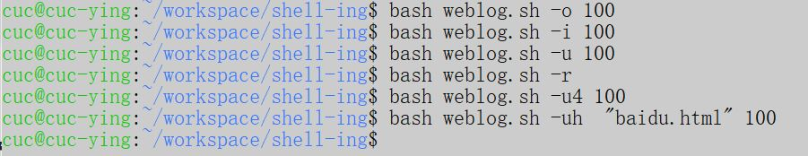

将得到的统计数据导出到weblog_data文件:

``` shell
scp -r cuc@192.168.56.103:/home/cuc/workspace/shell-ing/HostTop.log C:\Users\DELL\Desktop\2021-linux-public-real-pcl\chap0x04\chap0x04\weblog_data
scp -r cuc@192.168.56.103:/home/cuc/workspace/shell-ing/IpTop.log C:\Users\DELL\Desktop\2021-linux-public-real-pcl\chap0x04\chap0x04\weblog_data
scp -r cuc@192.168.56.103:/home/cuc/workspace/shell-ing/Response.log C:\Users\DELL\Desktop\2021-linux-public-real-pcl\chap0x04\chap0x04\weblog_data
scp -r cuc@192.168.56.103:/home/cuc/workspace/shell-ing/Response4xxTop.log C:\Users\DELL\Desktop\2021-linux-public-real-pcl\chap0x04\chap0x04\weblog_data
scp -r cuc@192.168.56.103:/home/cuc/workspace/shell-ing/SpecifiedURLHost.log C:\Users\DELL\Desktop\2021-linux-public-real-pcl\chap0x04\chap0x04\weblog_data
scp -r cuc@192.168.56.103:/home/cuc/workspace/shell-ing/UrlTop.log C:\Users\DELL\Desktop\2021-linux-public-real-pcl\chap0x04\chap0x04\weblog_data
```
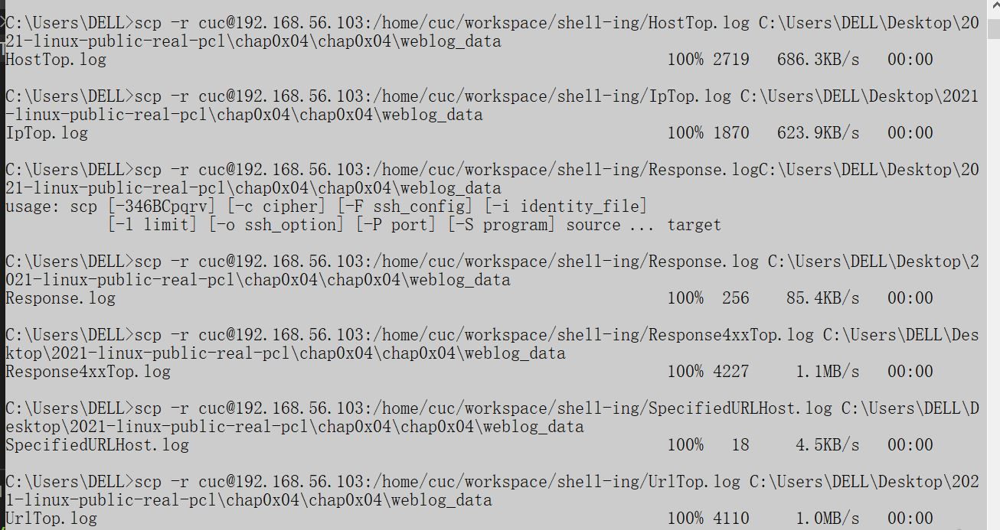

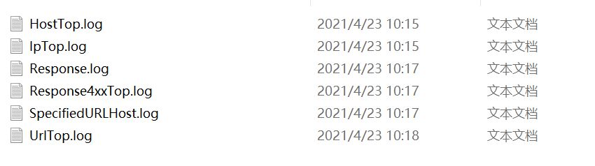

**数据结果**  ：

- [统计访问来源主机TOP 100和分别对应出现的总次数](weblog_data/HostTop.log)
- [统计访问来源主机TOP 100 IP和分别对应出现的总次数](weblog_data/IpTop.log)
- [统计最频繁被访问的URL TOP 100](weblog_data/UrlTop.log)
- [统计不同响应状态码的出现次数和对应百分比](weblog_data/Response.log)
- [分别统计不同4XX状态码对应的TOP 10 URL和对应出现的总次数](weblog_data/Response4XXTop.log)
- [给定URL输出TOP 100访问来源主机](weblog_data/SpecifiedURLHost.log)


------

#### 问题与解决方案：
- [将文件导入虚拟机以及将虚拟机中的文件导出到本地电脑scp命令](https://www.cnblogs.com/Teachertao/p/9571285.html)
- [if [ $# -eq 0 ]等语句定义](https://blog.csdn.net/qq_36932624/article/details/84594085)
- [Shell中的$0、$1、$2的含义](https://blog.csdn.net/weixin_43161811/article/details/84067192)
- [convert-linux-command-unix-command](https://www.lifewire.com/convert-linux-command-unix-command-4097060)
- [cenvert与mogrify的简单使用](https://www.jianshu.com/p/85a86b45c9ed)
- [git branch 命令查看分支、删除远程分支、本地分支](https://blog.csdn.net/duxing_langzi/article/details/80295573?utm_medium=distribute.pc_relevant_t0.none-task-blog-2%7Edefault%7EBlogCommendFromMachineLearnPai2%7Edefault-1.baidujs&dist_request_id=&depth_1-utm_source=distribute.pc_relevant_t0.none-task-blog-2%7Edefault%7EBlogCommendFromMachineLearnPai2%7Edefault-1.baidujs)
- [src refspec xxx does not match any 错误处理办法](https://blog.csdn.net/zhu1500527791/article/details/53119579)
- \与/,进行渲染的时候，使用分隔符“/”,这里有路径分隔符 / 被你写成了 URL 编码后的 %5C ，所以链接404： Not Found
- [commit与push](https://www.runoob.com/w3cnote/git-five-minutes-tutorial.html)
------

#### 参考：

- [linux-2020-cuc-Lynn](https://github.com/CUCCS/linux-2020-cuc-Lynn)
- [linux-2020-TlalalaT](https://github.com/CUCCS/linux-2020-TlalalaT)
- [将文件导入虚拟机以及将虚拟机中的文件导出到本地电脑scp命令](https://www.cnblogs.com/Teachertao/p/9571285.html)
- [if [ $# -eq 0 ]等语句定义](https://blog.csdn.net/qq_36932624/article/details/84594085)
- [Shell中的$0、$1、$2的含义](https://blog.csdn.net/weixin_43161811/article/details/84067192)
- [convert-linux-command-unix-command](https://www.lifewire.com/convert-linux-command-unix-command-4097060)
- [cenvert与mogrify的简单使用](https://www.jianshu.com/p/85a86b45c9ed)
