# 无人值守安装镜像实验报告

## 实验问题：

1.如何配置无人值守安装iso并在Virtualbox中完成自动化安装。
2.Virtualbox安装完Ubuntu之后新添加的网卡如何实现系统开机自动启用和自动获取IP？
3.如何使用sftp在虚拟机和宿主机之间传输文件？

## 实验步骤：
 
## 手动安装 Ubuntu20.04 镜像：
  (1)从官网搜索live-serve-amd64.ios，选择ubuntu-20.02.2-live-server-amd64.ios
  [Ubuntu20.04 镜像安装链接](https://releases.ubuntu.com/20.04/ubuntu-20.04.2-live-server-amd64.iso)

  (2)验证镜像是否完整：
  d1f2bf834bbe9bb43faf16f9be992a6f3935e65be0edece1dee2aa6eb1767423 *ubuntu-20.04.2-live-server-amd64.iso
  93bdab204067321ff131f560879db46bee3b994bf24836bb78538640f689e58f *ubuntu-20.04.2.0-desktop-amd64.iso

  (3)安装ubuntu
   新建虚拟机
   配置网卡
   设置用户名、密码
   安装成功
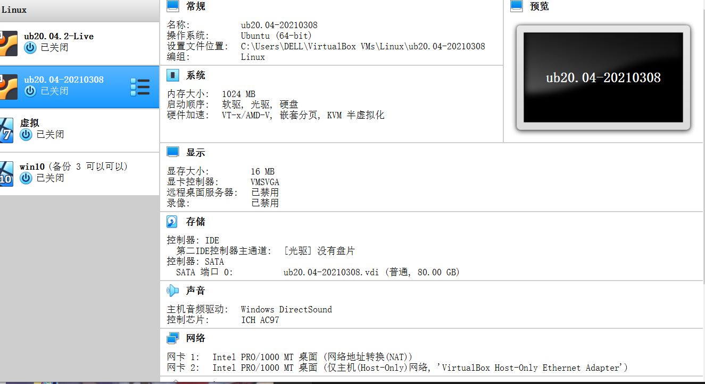

   ----------------
   ## 无人值守镜像安装

   ### 下载autoinstall-user-data文件

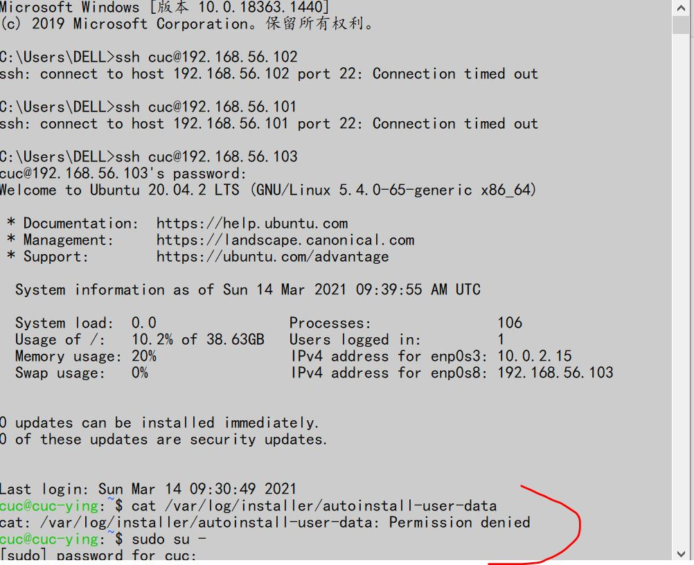
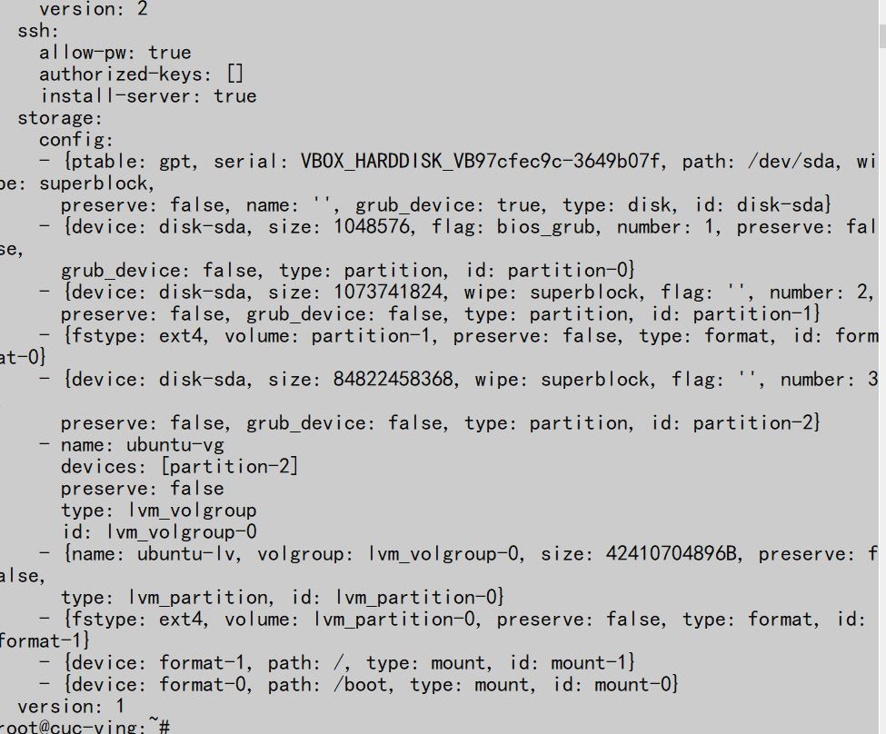

   ### autoinstall-user-data文件拷贝到本地

   ### 用vs code 打开autoinstall-user-data
   #cloud-config
autoinstall:
  apt:
    geoip: true
    preserve_sources_list: false
    primary:
    - arches: [amd64, i386]
      uri: http://archive.ubuntu.com/ubuntu
    - arches: [default]
      uri: http://ports.ubuntu.com/ubuntu-ports
  identity: {hostname: cuc-ying, password: $6$MNQ/gm0JTzjvsHex$BYy5IwcIlbeBZY3OSkgrnfyxGCf9tzYtN.OWMZ97GTLf0cH5Vm7PiwhLgH9sPWC9Sceqw5PnZUJc62plNLBqu0,
    realname: cuc, username: cuc}
  keyboard: {layout: us, toggle: null, variant: ''}
  locale: en_US
  network:
    ethernets:
      enp0s3: {dhcp4: true}
      enp0s8: {dhcp4: true}
    version: 2
  ssh:
    allow-pw: true
    authorized-keys: []
    install-server: true
  storage:
    config:
    - {ptable: gpt, serial: VBOX_HARDDISK_VB97cfec9c-3649b07f, path: /dev/sda, wipe: superblock,
      preserve: false, name: '', grub_device: true, type: disk, id: disk-sda}
    - {device: disk-sda, size: 1048576, flag: bios_grub, number: 1, preserve: false,
      grub_device: false, type: partition, id: partition-0}
    - {device: disk-sda, size: 1073741824, wipe: superblock, flag: '', number: 2,
      preserve: false, grub_device: false, type: partition, id: partition-1}
    - {fstype: ext4, volume: partition-1, preserve: false, type: format, id: format-0}
    - {device: disk-sda, size: 84822458368, wipe: superblock, flag: '', number: 3,
      preserve: false, grub_device: false, type: partition, id: partition-2}
    - name: ubuntu-vg
      devices: [partition-2]
      preserve: false
      type: lvm_volgroup
      id: lvm_volgroup-0
    - {name: ubuntu-lv, volgroup: lvm_volgroup-0, size: 42410704896B, preserve: false,
      type: lvm_partition, id: lvm_partition-0}
    - {fstype: ext4, volume: lvm_partition-0, preserve: false, type: format, id: format-1}
    - {device: format-1, path: /, type: mount, id: mount-1}
    - {device: format-0, path: /boot, type: mount, id: mount-0}
  version: 1
   ### 用vs code 打开 uesr-data
   #cloud-config
autoinstall:
  apt:
    geoip: true
    preserve_sources_list: false
    primary:
    - arches: [amd64, i386]
      uri: http://cn.archive.ubuntu.com/ubuntu
    - arches: [default]
      uri: http://ports.ubuntu.com/ubuntu-ports
  identity: {hostname: reiner-braun, password: $6$wZ/7F2MYhhkA84WJ$KV54keiT6Oo7x0vkOUgf4clBmW0rLRrfNyIEl2VN595KN4mF.8AesNjtWZsKkJoMufoIx6A3F/ZjjLlaco9mw0,
    realname: reiner, username: reiner}
  keyboard: {layout: us, toggle: null, variant: ''}
  timezone: Asia/Shanghai
  locale: en_US.UTF-8
  network:
    ethernets:
      enp0s3: {dhcp4: true}
      enp0s8: {dhcp4: true}
    version: 2
  ssh:
    allow-pw: true
    authorized-keys: []
    install-server: true
  storage:
    config:
    - {ptable: gpt, path: /dev/sda, wipe: superblock,
      preserve: false, name: '', grub_device: true, type: disk, id: disk-sda}
    - {device: disk-sda, size: 1MB, flag: bios_grub, number: 1, preserve: false,
      grub_device: false, type: partition, id: partition-0}
    - {device: disk-sda, size: 1GB, wipe: superblock, flag: '', number: 2,
      preserve: false, grub_device: false, type: partition, id: partition-1}
    - {fstype: ext4, volume: partition-1, preserve: false, type: format, id: format-0}
    - {device: disk-sda, size: -1, wipe: superblock, flag: '', number: 3,
      preserve: false, grub_device: false, type: partition, id: partition-2}
    - name: ubuntu-vg
      devices: [partition-2]
      preserve: false
      type: lvm_volgroup
      id: lvm_volgroup-0
    - {name: ubuntu-lv, volgroup: lvm_volgroup-0, size: -1, preserve: false,
      type: lvm_partition, id: lvm_partition-0}
    - {fstype: ext4, volume: lvm_partition-0, preserve: false, type: format, id: format-1}
    - {device: format-1, path: /, type: mount, id: mount-1}
    - {device: format-0, path: /boot, type: mount, id: mount-0}
  version: 1
    
 ### 比对一下  修改autoinstall-user-data 另存为user-data并创造一个空文件meta-data

    
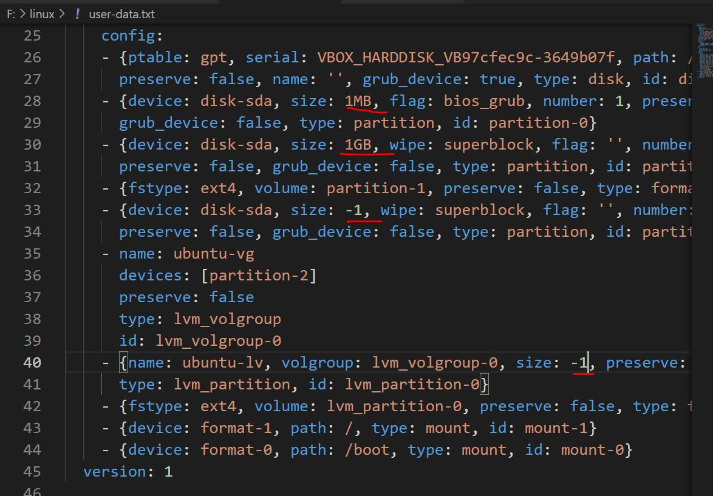

### 制作cloud-init镜像

   安装依赖工具
   ubuntu：
   sudo apt-get install genisoimage

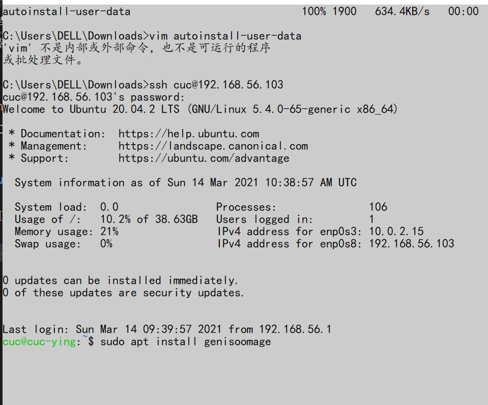

   将修改过的user-data和meta-data传到Linux中的tmp文件下
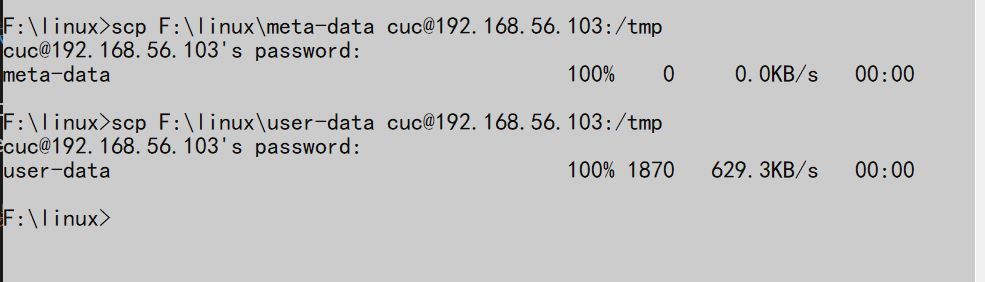

   生成镜像
   ubuntu：
   genisoimage -output init.iso -volid cidata -joliet -rock user-data meta-data(genisoimage -input-charset utf-8 -output init.iso -volid cidata -joliet -rock user-data meta-data)

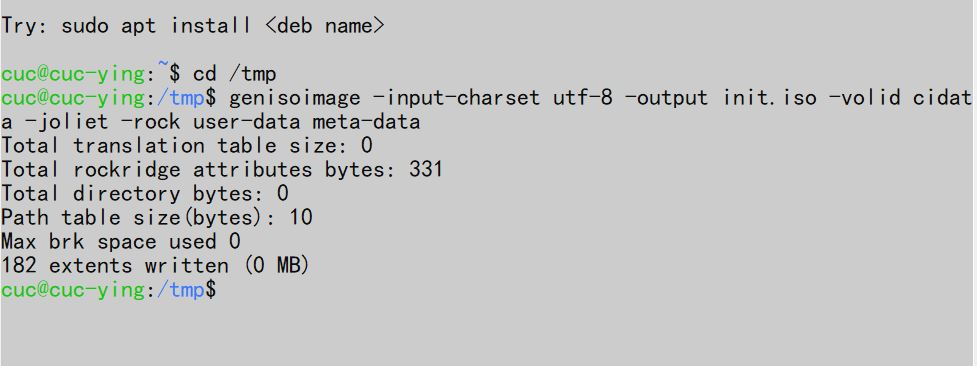

   生成ISO文件

   将\network-config.yaml 传入Linux tmp文件下
   scp F:\linux\network-config.yaml cuc@192.168.56.103:/tmp
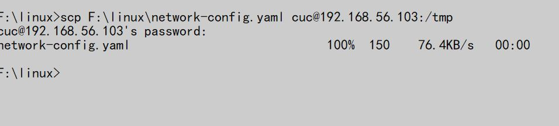

   生成镜像：genisoimage -input-charset utf-8 -output init.iso -volid cidata -joliet -rock network-config.yaml
   (先进入tmp文件 cd/tmp)
   
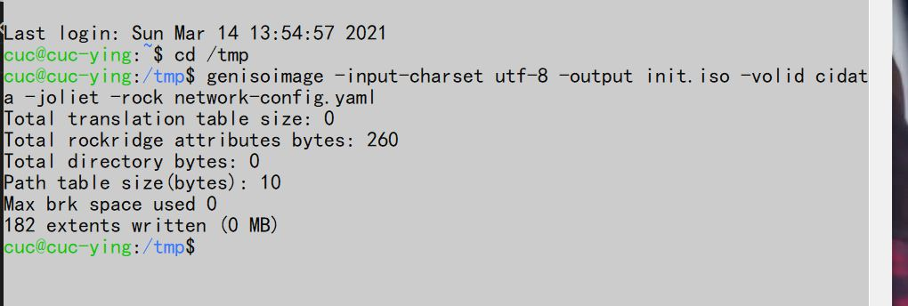
   
   ## 安装无人值守

   新建虚拟机
   1.focal-auto-demo
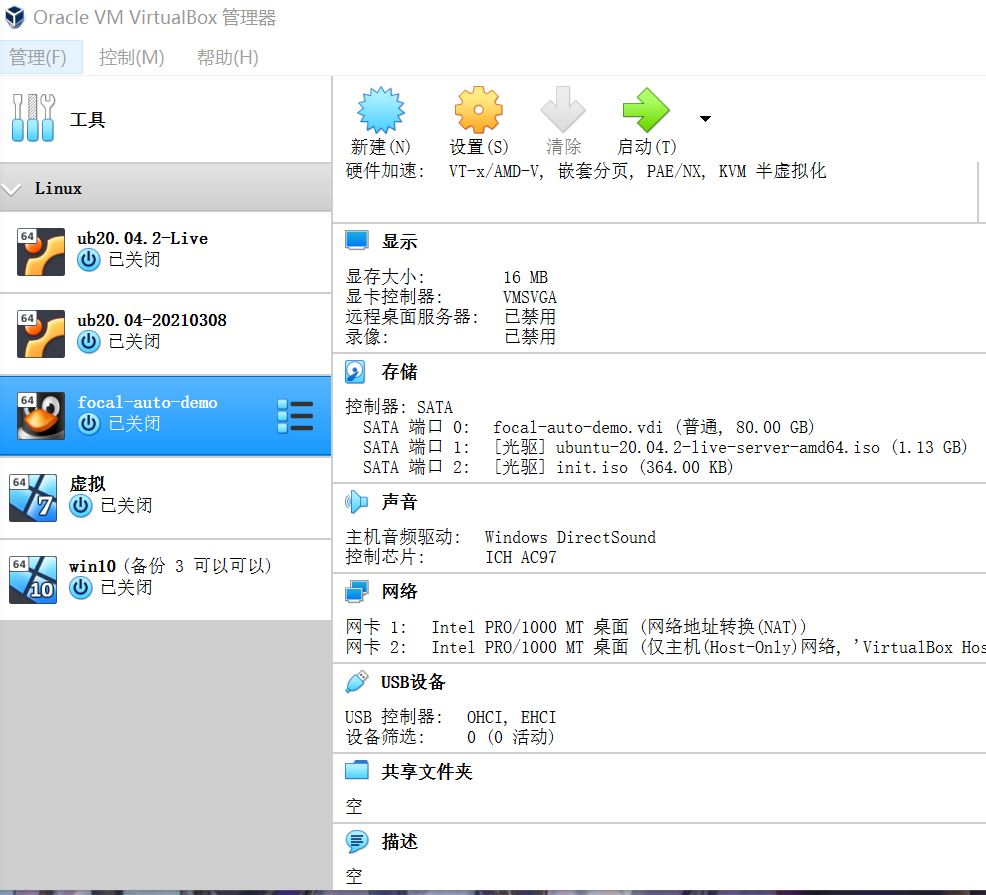
   

   安装成功

 ## 实验中遇到的问题及解决方法
    1.下载genisoimage时，使用命令： sudo apt install genisoimage 
    出现错误：E: Unable to locate package genisoomage
    命令改为：sudo apt-get install genisoimage
    成功
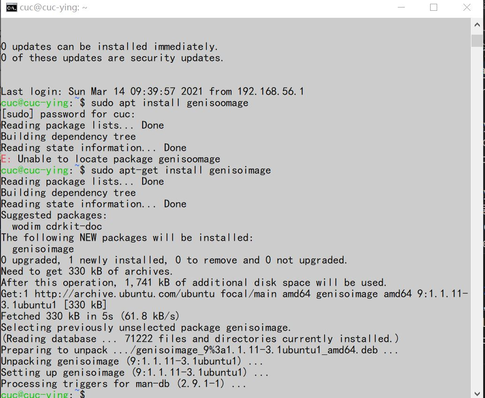

    2.用户名打错
     
    3.No such file or directory
    后缀名没有加上
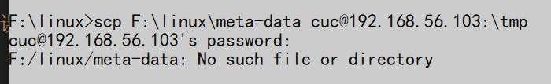
    解决：去掉了后缀

    4.生成镜像错误
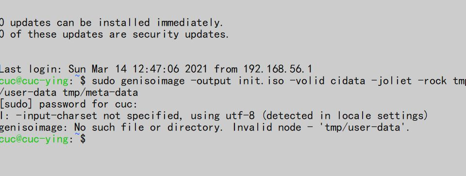
解决方法：现进入tmp目录下，然后执行操作genisoimage -input-charset utf-8 -output init.iso -volid cidata -joliet -rock user-data meta-data

## 注意：
  ls查看当前目录下的文件
  cd /tmp进入 /tmp 目录执行命令

  

  

